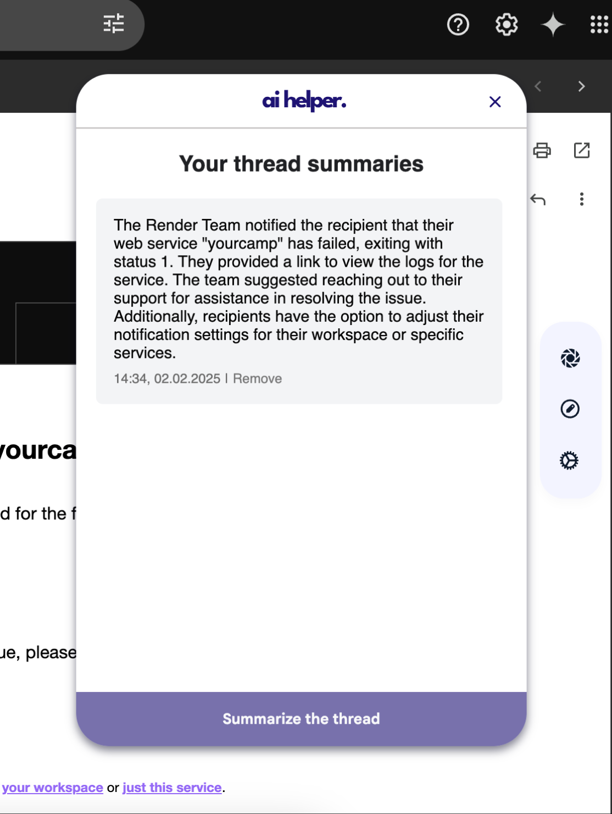
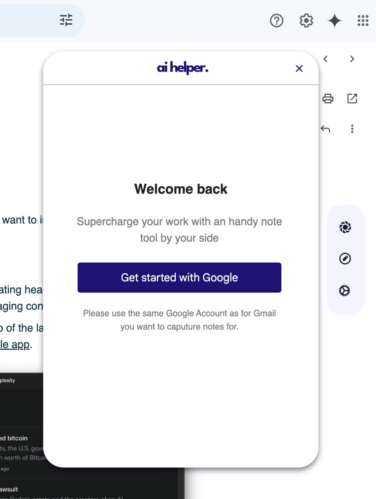
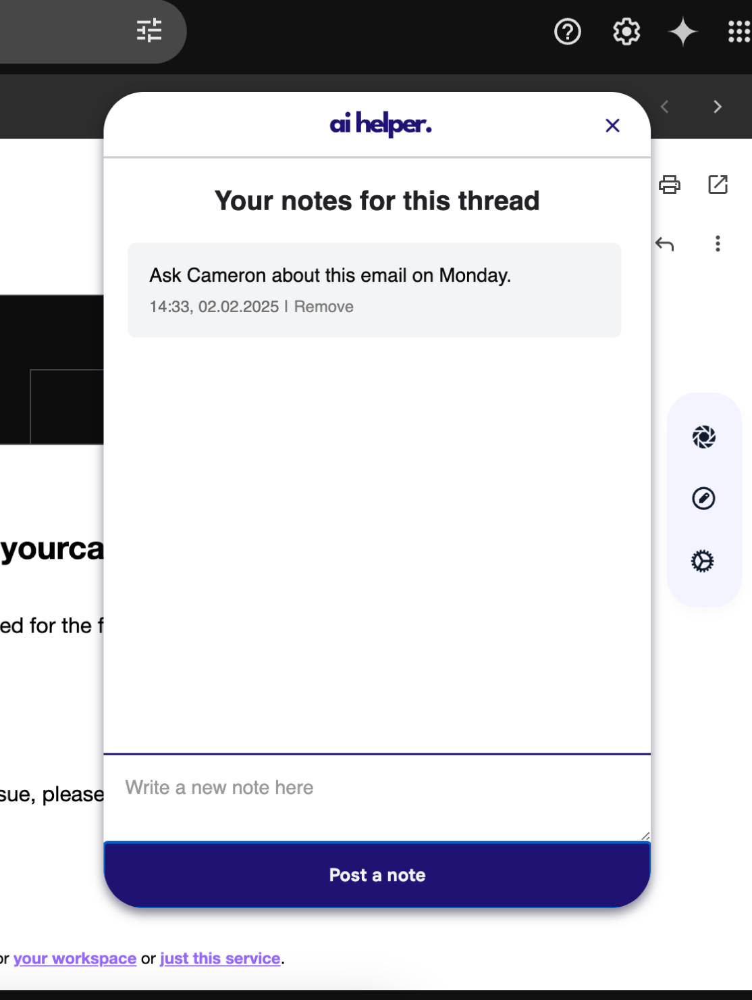

# 🚀 Chrome Extension: Gmail Thread Summarizer

## 📝 About

This Chrome extension enhances Gmail by providing **AI-powered thread summaries**, making it easier for users to quickly grasp the key points of long email conversations. Built with **JavaScript, React, Express, MongoDB, and OAuth 2.0**, it integrates seamlessly into Gmail for an optimized workflow.

## 🔗 Live Demo

Currently deployment is in progress.

## ⚡ Tech Stack

- **Frontend:** React, JavaScript
- **Backend:** Express, MongoDB
- **Authentication:** OAuth 2.0 (Google Sign-In)
- **AI Integration:** OpenAI API
- **Build Tools:** Webpack

## 📂 Project Structure

```
📦 src
 ├── background/         # Background scripts handling persistent tasks
 │   ├── api/
 │   ├── auth/
 │   ├── backgroundMain.js
 │
 ├── content/            # Content scripts interacting with the Gmail UI
 │   ├── aiFunctionalityUtils.js
 │   ├── hashHandler.js
 │   ├── messagesToBk.js
 │   ├── observer.js
 │
 ├── dashboard/          # User-facing dashboard for managing summaries
 │   ├── dsBtnListenersForLogin.js
 │   ├── dsBtnListenersForNotes.js
 │   ├── dsBtnListenersForScreens.js
 │   ├── dsMainLogic.js
 │   ├── dsNoteManipulation.js
 │   ├── dsNotifHandler.js
 │   ├── dsSummaryManipulation.js
 │   ├── dsUtils.js
 │
 ├── widget/             # Popup UI and widgets
 │   ├── index.js
 │   ├── popup.js
 │
 ├── static/             # Static assets (icons, styles, etc.)
 │
 ├── utils.js            # Utility functions
 │
 ├── package.json        # Dependencies and scripts
 ├── webpack.config.js   # Webpack configuration
 └── .gitignore          # Ignored files
```

## 🛠️ Setup & Installation

```
git clone https://github.com/yourusername/gmail-thread-summarizer.git
cd gmail-thread-summarizer
npm install
npm run build
```

### Load the Extension in Chrome:

1. Open **chrome://extensions/** in your browser.
2. Enable **Developer Mode** (toggle in the top-right corner).
3. Click **Load Unpacked** and select the `src` directory.
4. Pin the extension for easy access!

## 📸 Screenshots

### 🔹 Summary Feature



### 🔹 Login View



### 🔹 Notes View



## 🚀 Deployment

To deploy with **Vercel**:

```
npm run build
vercel deploy
```

## 🤝 Connect with Me

- **LinkedIn:** [linkedin.com/in/yourname](https://linkedin.com/in/yourname)
- **GitHub:** [github.com/yourusername](https://github.com/yourusername)
- **Email:** [youremail@example.com](mailto:youremail@example.com)
